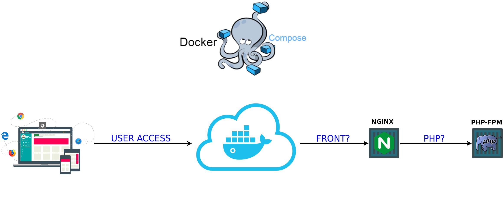

# Welcome to MDP 
#### Molecular Degree of Perturbation ·· ··


- Every time you download these files, you must extract the **`.htaccess`** file _(It's inside the zipped file)_ to the root of the folder where the index.php file is located. That's because the Github server rejects that kind of file.

- It is responsible for hiding the file extension. For example: instead of being **mdp.com/index.php** it will be **mdp.com/index**.

- In the **`files/assets/js/global.js`** file change **``mysite``** to the url the tool is hosted on

```js
var url_site = "http://mysite/";
```

#### TODO

* [ ] Separed repository front/back files
* [ ] Automatic pull

## Containers

- *Frontend* - NGINX;
- *Backend PHP* - PHP-FPM;

2 Containers.

## Infrastructure



# * 
Environment and maintenance of SSL certificates, in the following repository [Reverse Provy Apps](https://gitlab.com/integrativebioinformatics/reverse_proxy_apps) .

## Requisites

- Docker version 17.09.1-ce or above (https://docs.docker.com/install/)
- Docker Compose 1.20.1 or above (https://docs.docker.com/compose/install)

## Installation

Clone the repository recursively with:
```
user@host:~# git clone --recurse-submodules https://gitlab.com/integrativebioinformatics/mdp.git
```
This mode the externals repositorys the frontend and backend are cloned.


## Pre-Execution

Define permissions for user `www-data` in directory back/front which will be mounted as volume in container. Because the user may not exist on the host host, we use the gid that is standard on any system. Execute:

```bash
user@host:~/mdp# chown 33:33 -R mdp_files
```

## Execution

In the root repository, execute the next command:

```bash
user@host:~/mdp# docker-compose up -d
```
The option `-d` execute containers in background.

**OBS.:** For scalability reasons, this project was designed to receive requests from a proxy, so port 80 is not exposed. If you need to run the environment locally (exposed port 80), the command is as follows:

```bash
user@host:~/mdp# docker-compose -f docker-compose-local.yml up -d
```

Enjoy!


